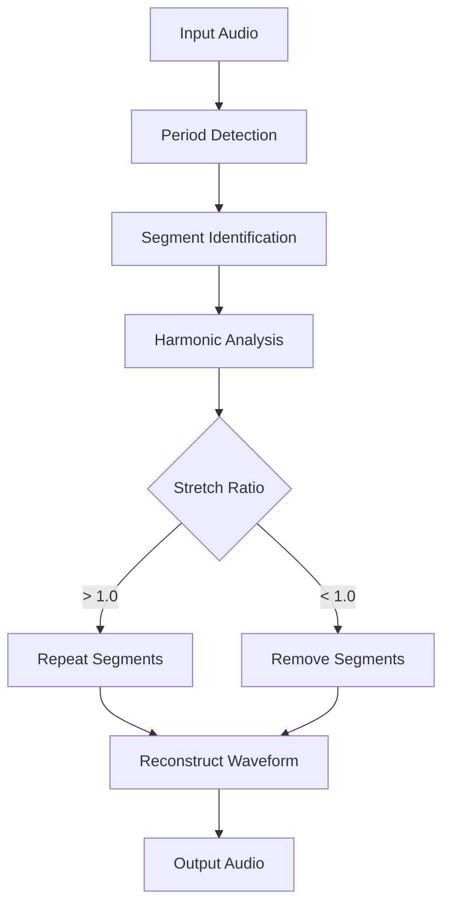
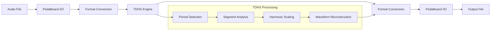

# How It Works

AudioStretchy uses sophisticated signal processing techniques to change audio duration while preserving pitch. This guide explains the underlying algorithms and processing pipeline.

## Overview

Audio time-stretching without pitch changes is a complex problem in digital signal processing. AudioStretchy solves this using the **Time-Domain Harmonic Scaling (TDHS)** algorithm, which operates directly on audio waveforms to intelligently modify their timing structure.

## The Challenge

### Simple Speed Change Problems

Naive approaches to changing audio speed have significant limitations:

- **Playback rate changes**: Altering playback speed changes both duration and pitch (like playing a record at wrong speed)
- **Sample dropping/repeating**: Simple sample manipulation creates audible artifacts
- **Linear interpolation**: Basic stretching creates distortion and loses harmonic content

### What We Need

Ideal time-stretching should:

1. **Preserve pitch**: Fundamental frequencies remain unchanged
2. **Maintain timbre**: Harmonic content and formants stay intact
3. **Avoid artifacts**: No clicking, distortion, or robotic sounds
4. **Handle various content**: Work well with speech, music, and mixed audio

## Time-Domain Harmonic Scaling (TDHS)

### Algorithm Principles

TDHS operates on these key insights:

1. **Harmonic Structure**: Audio signals contain repeating patterns related to pitch
2. **Time-Domain Analysis**: Working directly with waveform samples avoids frequency-domain artifacts
3. **Intelligent Segmentation**: Audio is divided into meaningful periods for processing
4. **Selective Modification**: Only timing is altered, harmonic relationships are preserved

### Processing Steps



#### 1. Period Detection

The algorithm first identifies fundamental periods in the audio:

- **Frequency Analysis**: Looks for repeating patterns within specified frequency ranges
- **Autocorrelation**: Finds self-similarity at different time lags
- **Period Validation**: Confirms detected periods represent true harmonic content

```python
# Conceptual period detection
def detect_periods(audio_data, lower_freq, upper_freq, sample_rate):
    # Convert frequency limits to sample periods
    min_period = sample_rate // upper_freq
    max_period = sample_rate // lower_freq
    
    # Find repeating patterns in this range
    periods = find_autocorrelation_peaks(audio_data, min_period, max_period)
    return validate_periods(periods)
```

#### 2. Segment Classification

Audio is classified into different types:

- **Harmonic segments**: Contain clear pitch information
- **Noise segments**: Random or non-periodic content
- **Silence/gaps**: Low-energy regions
- **Transients**: Attack portions of sounds

#### 3. Selective Processing

Different segment types are handled differently:

=== "Stretching (Ratio > 1.0)"

    - **Harmonic segments**: Intelligent period repetition
    - **Noise segments**: Simple interpolation or repetition
    - **Silence**: Extended proportionally or per gap_ratio
    - **Transients**: Minimal modification to preserve attack

=== "Compression (Ratio < 1.0)"

    - **Harmonic segments**: Selective period removal
    - **Noise segments**: Downsampling or decimation
    - **Silence**: Reduced proportionally or per gap_ratio
    - **Transients**: Preserved when possible

### Mathematical Foundation

The core TDHS operation can be expressed as:

```
For stretch ratio R > 1.0:
- Identify periods P₁, P₂, ..., Pₙ
- Insert additional periods: P₁, P₁', P₂, P₂', ...
- Where P₁' is a shifted/modified copy of P₁

For compression ratio R < 1.0:
- Remove selective periods: P₁, P₃, P₅, ...
- Maintain harmonic continuity at boundaries
```

## AudioStretchy Implementation

### Processing Pipeline

AudioStretchy implements TDHS through a multi-layer architecture:



### 1. Audio Input/Output Layer

**Pedalboard Integration**:
- Handles diverse audio formats (MP3, FLAC, WAV, etc.)
- Provides high-quality resampling
- Manages metadata and format conversion

```python
# Conceptual I/O layer
def load_audio(file_path):
    # Use Pedalboard to load various formats
    audio_data, sample_rate, channels = pedalboard.load(file_path)
    return convert_to_processing_format(audio_data)

def save_audio(audio_data, file_path, format_info):
    # Convert back from processing format
    output_data = convert_from_processing_format(audio_data)
    pedalboard.save(output_data, file_path, format_info)
```

### 2. Data Format Conversion

**Format Pipeline**:
- **Input**: Float32 samples from Pedalboard
- **Processing**: Int16 samples for C library
- **Output**: Float32 samples back to Pedalboard

```python
# Data conversion pipeline
def prepare_for_tdhs(float32_audio):
    # Convert to int16 for C library
    int16_audio = (float32_audio * 32767).astype(np.int16)
    
    # Handle stereo interleaving
    if stereo:
        return interleave_channels(int16_audio)
    return int16_audio

def process_tdhs_output(int16_audio):
    # Convert back to float32
    float32_audio = int16_audio.astype(np.float32) / 32767.0
    
    # Handle stereo de-interleaving
    if stereo:
        return deinterleave_channels(float32_audio)
    return float32_audio
```

### 3. TDHS Core Engine

**C Library Interface**:
- David Bryant's optimized C implementation
- ctypes binding for Python integration
- Platform-specific shared libraries

```python
# Simplified C interface
class TDHSAudioStretch:
    def __init__(self, sample_rate, channels):
        self.c_lib = load_platform_library()
        self.context = self.c_lib.stretch_init(sample_rate, channels)
    
    def stretch(self, audio_data, ratio, **params):
        # Configure stretching parameters
        self.c_lib.stretch_configure(self.context, ratio, **params)
        
        # Process audio
        output_data = self.c_lib.stretch_samples(self.context, audio_data)
        
        # Finalize processing
        final_data = self.c_lib.stretch_flush(self.context)
        
        return combine_output(output_data, final_data)
```

## Parameter Impact on Quality

### Frequency Range Parameters

**Upper and Lower Frequency Limits**:

These parameters guide period detection:

- **Narrow range**: More precise period detection, better for specific content
- **Wide range**: More flexible, handles diverse content but may be less accurate

```python
# Content-specific optimization
speech_params = {
    'upper_freq': 300,  # Human speech rarely exceeds 300Hz fundamental
    'lower_freq': 80    # Typical lower bound for speech
}

music_params = {
    'upper_freq': 400,  # Instruments can have higher fundamentals
    'lower_freq': 50    # Include bass instruments
}
```

### Quality vs. Speed Trade-offs

**Detection Modes**:

=== "Normal Detection"

    - **Quality**: Highest
    - **Speed**: Slower
    - **Use case**: Final production, critical applications

=== "Fast Detection"

    - **Quality**: Good
    - **Speed**: Faster
    - **Use case**: Testing, real-time applications

=== "Auto Detection"

    - **Quality**: Adaptive
    - **Speed**: Moderate
    - **Use case**: General purpose

### Ratio Range Considerations

**Standard Range (0.5 - 2.0)**:
- Well-tested ratio range
- Reliable quality
- Suitable for most applications

**Extended Range (0.25 - 4.0)**:
- Extreme stretching capabilities
- Potential quality degradation
- Requires `double_range=True`

## Algorithm Limitations

### Current Limitations

1. **Gap Ratio Implementation**: 
   - Python wrapper doesn't pre-segment audio
   - Relies on C library's internal gap detection
   - May not be as effective as dedicated preprocessing

2. **Real-time Processing**:
   - Not optimized for streaming
   - Requires complete audio buffer
   - Processing latency proportional to audio length

3. **Content Sensitivity**:
   - Works best with harmonic content
   - May struggle with pure noise or percussive sounds
   - Extreme ratios can introduce artifacts

### Best Practices

**For Optimal Results**:

1. **Match parameters to content type**
2. **Use moderate ratios when possible** (0.7 - 1.5)
3. **Test different frequency ranges** for your specific audio
4. **Consider preprocessing** for mixed content
5. **Validate output quality** especially for extreme ratios

## Comparison with Other Algorithms

### Phase Vocoder

- **Approach**: Frequency-domain processing
- **Pros**: Well-understood, flexible
- **Cons**: Can introduce phasiness, artifacts

### PSOLA (Pitch Synchronous Overlap and Add)

- **Approach**: Pitch-period based manipulation
- **Pros**: Good for speech
- **Cons**: Requires accurate pitch detection

### TDHS Advantages

- **Time-domain processing**: Avoids frequency-domain artifacts
- **Harmonic preservation**: Maintains natural sound quality
- **Robustness**: Works well across different content types
- **Efficiency**: Optimized C implementation

## Future Enhancements

### Potential Improvements

1. **Advanced Gap Handling**:
   - Python-side audio segmentation
   - Intelligent silence detection
   - Content-aware ratio application

2. **Real-time Capabilities**:
   - Streaming processing
   - Reduced latency buffering
   - Live audio applications

3. **Quality Metrics**:
   - Automated quality assessment
   - Parameter optimization
   - Perceptual quality measures

4. **Extended Content Support**:
   - Polyphonic music handling
   - Percussive content optimization
   - Multi-language speech adaptation

## Understanding Quality Factors

The quality of time-stretched audio depends on several factors:

### Input Audio Characteristics

- **Harmonic content**: Clear pitch makes stretching easier
- **Signal-to-noise ratio**: Clean audio processes better
- **Complexity**: Simple signals stretch more cleanly than complex ones

### Processing Parameters

- **Ratio magnitude**: Smaller changes generally sound better
- **Frequency range**: Proper tuning improves period detection
- **Detection quality**: Higher quality modes produce better results

### Output Requirements

- **Use case**: Different applications have different quality needs
- **Playback system**: High-quality systems reveal more artifacts
- **Listener sensitivity**: Some listeners are more sensitive to artifacts

Next: [Core Architecture](06-core-architecture.md) for implementation details