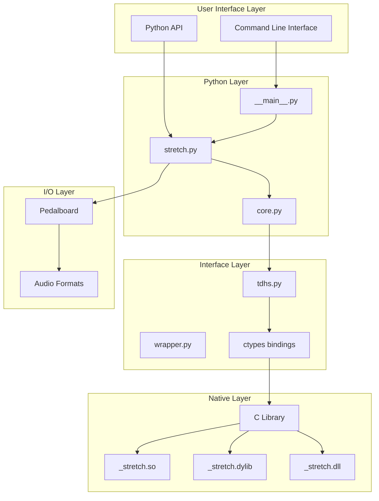
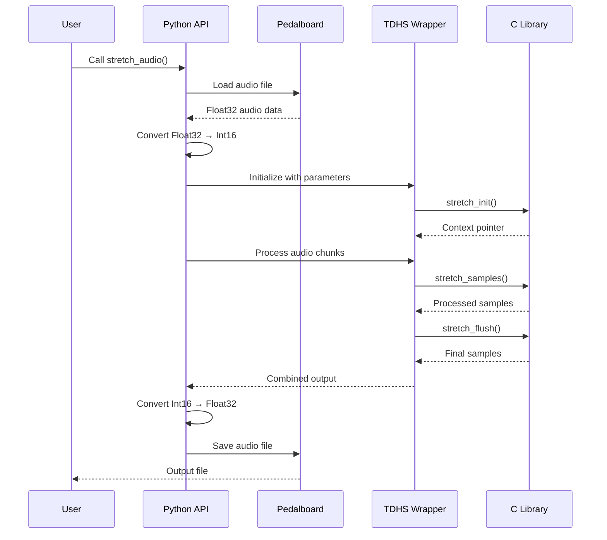
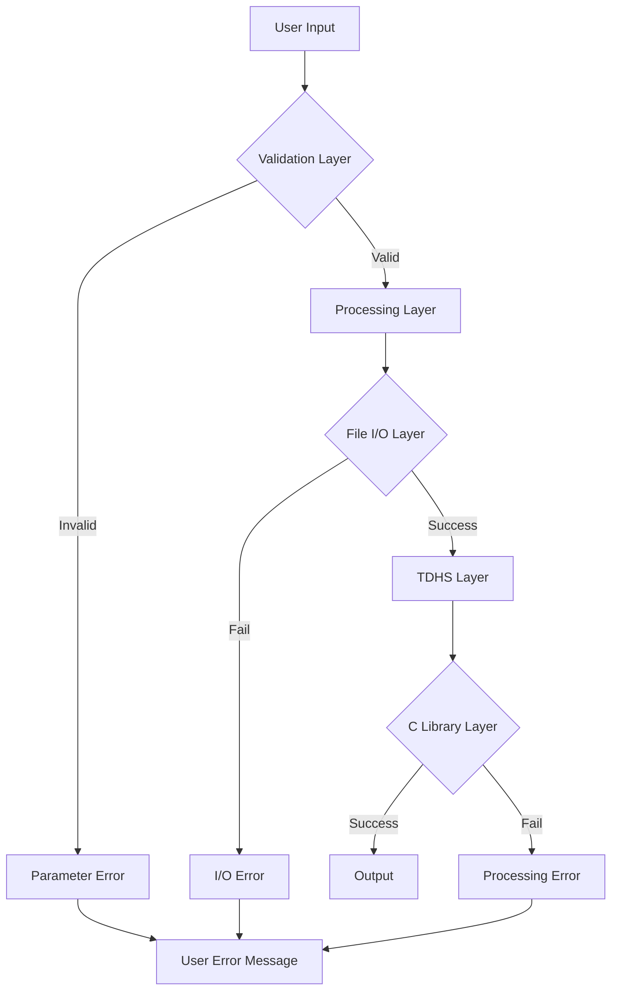

# Core Architecture

AudioStretchy's architecture is designed for high performance, cross-platform compatibility, and ease of use. This guide explores the internal components, data flow, and design decisions.

## System Overview



## Module Architecture

### Core Python Modules

#### `src/audiostretchy/__main__.py`

**Purpose**: Command-line interface entry point

```python
# this_file: src/audiostretchy/__main__.py
"""
CLI entry point using Fire library
- Parses command line arguments  
- Calls stretch_audio function
- Handles basic error reporting
"""

import fire
from .stretch import stretch_audio

def main():
    """CLI entry point"""
    fire.Fire(stretch_audio)

if __name__ == "__main__":
    main()
```

**Key Features**:
- Uses Python Fire for automatic CLI generation
- Minimal code, maximum functionality
- All parameters automatically exposed as CLI options

#### `src/audiostretchy/stretch.py`

**Purpose**: Main orchestration and public API

```python
# this_file: src/audiostretchy/stretch.py
"""
Core AudioStretch class and convenience functions
- File I/O management via Pedalboard
- Data format conversion
- TDHS algorithm orchestration
- Error handling and validation
"""

class AudioStretch:
    """Main audio processing class"""
    
    def __init__(self):
        self.audio_file = None
        self.sample_rate = None
        self.channels = None
        
    def open(self, file_path_or_object, format=None):
        """Load audio file using Pedalboard"""
        
    def stretch(self, ratio=1.0, **params):
        """Apply TDHS time-stretching"""
        
    def resample(self, target_framerate):
        """Resample audio using Pedalboard"""
        
    def save(self, file_path_or_object, format=None):
        """Save processed audio"""

def stretch_audio(input_path, output_path, **params):
    """Convenience function for simple stretching"""
```

**Responsibilities**:
- File format handling
- Parameter validation
- Data flow coordination
- Public API surface

#### `src/audiostretchy/core.py`

**Purpose**: Core processing logic (minimal, mainly imports)

```python
# this_file: src/audiostretchy/core.py
"""
Core processing imports and utilities
Currently minimal - may expand for shared utilities
"""

# Re-exports for internal use
from .interface.tdhs import TDHSAudioStretch
from .stretch import AudioStretch, stretch_audio
```

### Interface Layer

#### `src/audiostretchy/interface/tdhs.py`

**Purpose**: Python-C interface using ctypes

```python
# this_file: src/audiostretchy/interface/tdhs.py
"""
TDHS C library wrapper
- Platform detection and library loading
- ctypes function signatures
- Data conversion between Python/C
- Memory management
"""

import ctypes
import platform
from pathlib import Path

class TDHSAudioStretch:
    """Python wrapper for TDHS C library"""
    
    def __init__(self):
        self.lib = self._load_library()
        self._setup_function_signatures()
        self.context = None
        
    def _load_library(self):
        """Load platform-specific shared library"""
        system = platform.system()
        machine = platform.machine()
        
        if system == "Windows":
            lib_name = "_stretch.dll"
            lib_dir = "win"
        elif system == "Darwin":
            lib_name = "_stretch.dylib"
            lib_dir = "mac"
        elif system == "Linux":
            lib_name = "_stretch.so"
            lib_dir = "linux"
        else:
            raise RuntimeError(f"Unsupported platform: {system}")
            
        lib_path = Path(__file__).parent / lib_dir / lib_name
        return ctypes.CDLL(str(lib_path))
    
    def _setup_function_signatures(self):
        """Define ctypes function signatures"""
        # stretch_init function
        self.lib.stretch_init.argtypes = [
            ctypes.c_int,    # sample_rate
            ctypes.c_int,    # channels
            ctypes.c_double, # ratio
            # ... other parameters
        ]
        self.lib.stretch_init.restype = ctypes.c_void_p
        
        # Other function signatures...
```

**Key Features**:
- Cross-platform library loading
- Type-safe ctypes bindings
- Memory management
- Error handling

### Native C Library

#### Platform-Specific Binaries

The C library is compiled for multiple platforms:

=== "Linux"

    **Location**: `src/audiostretchy/interface/linux/_stretch.so`
    
    **Build**: GCC/Clang compilation
    ```bash
    gcc -shared -fPIC -O3 stretch.c -o _stretch.so
    ```

=== "macOS"

    **Location**: `src/audiostretchy/interface/mac/_stretch.dylib`
    
    **Build**: Universal binary (x86_64 + arm64)
    ```bash
    clang -shared -O3 -arch x86_64 -arch arm64 stretch.c -o _stretch.dylib
    ```

=== "Windows"

    **Location**: `src/audiostretchy/interface/win/_stretch.dll`
    
    **Build**: MSVC compilation
    ```bash
    cl /LD /O2 stretch.c /Fe:_stretch.dll
    ```

#### C Library Interface

The C library exposes these key functions:

```c
// Initialize stretching context
void* stretch_init(int sample_rate, int channels, double ratio, ...);

// Process audio samples
int stretch_samples(void* context, short* input, int input_length, 
                   short* output, int* output_length);

// Flush remaining samples
int stretch_flush(void* context, short* output, int* output_length);

// Clean up context
void stretch_cleanup(void* context);
```

## Data Flow

### Processing Pipeline



### Memory Management

#### Audio Data Lifecycle

1. **Loading**: Pedalboard loads audio into NumPy arrays (Float32)
2. **Conversion**: Python converts to Int16 for C library
3. **Processing**: C library processes data in chunks
4. **Collection**: Python collects processed chunks
5. **Conversion**: Back to Float32 for Pedalboard
6. **Saving**: Pedalboard writes to output format

#### Memory Optimization

```python
def memory_efficient_stretch(audio_data, ratio):
    """Memory-efficient processing for large files"""
    
    chunk_size = 8192  # Process in chunks
    output_chunks = []
    
    for i in range(0, len(audio_data), chunk_size):
        chunk = audio_data[i:i + chunk_size]
        processed = process_chunk(chunk, ratio)
        output_chunks.append(processed)
        
        # Optional: explicit memory cleanup
        del chunk
        
    return np.concatenate(output_chunks)
```

## Error Handling Architecture

### Layered Error Handling



### Error Categories

#### 1. Input Validation Errors

```python
class ParameterError(ValueError):
    """Invalid parameter values"""
    pass

def validate_ratio(ratio):
    if not isinstance(ratio, (int, float)):
        raise ParameterError("Ratio must be a number")
    if ratio <= 0:
        raise ParameterError("Ratio must be positive")
    if ratio > 4.0 or ratio < 0.25:
        raise ParameterError("Ratio out of supported range")
```

#### 2. File I/O Errors

```python
def safe_file_open(file_path):
    try:
        return pedalboard_load(file_path)
    except FileNotFoundError:
        raise FileNotFoundError(f"Input file not found: {file_path}")
    except PermissionError:
        raise PermissionError(f"Cannot read file: {file_path}")
    except Exception as e:
        raise RuntimeError(f"Failed to load audio: {e}")
```

#### 3. Processing Errors

```python
def safe_tdhs_process(context, audio_data):
    try:
        return tdhs_library.process(context, audio_data)
    except ctypes.ArgumentError:
        raise RuntimeError("Invalid audio data format")
    except OSError as e:
        raise RuntimeError(f"C library error: {e}")
```

## Configuration Management

### Parameter Hierarchy

AudioStretchy supports multiple configuration levels:

1. **Defaults**: Built-in sensible defaults
2. **Function parameters**: Direct function arguments
3. **Environment variables**: System-level configuration
4. **Config files**: Persistent user preferences (future)

```python
class ParameterManager:
    """Manage parameter precedence"""
    
    DEFAULTS = {
        'ratio': 1.0,
        'upper_freq': 333,
        'lower_freq': 55,
        # ... other defaults
    }
    
    def resolve_parameters(self, **kwargs):
        """Resolve parameters with precedence"""
        params = self.DEFAULTS.copy()
        
        # Environment variables
        params.update(self._load_env_params())
        
        # Function arguments (highest priority)
        params.update({k: v for k, v in kwargs.items() if v is not None})
        
        return params
```

## Platform Compatibility

### Cross-Platform Design

#### File Path Handling

```python
from pathlib import Path

def normalize_path(path_input):
    """Normalize paths across platforms"""
    if isinstance(path_input, str):
        return Path(path_input).resolve()
    return path_input  # Assume file-like object
```

#### Library Loading

```python
def get_library_path():
    """Get platform-specific library path"""
    import platform
    
    system_map = {
        'Windows': ('win', '_stretch.dll'),
        'Darwin': ('mac', '_stretch.dylib'),
        'Linux': ('linux', '_stretch.so'),
    }
    
    system = platform.system()
    if system not in system_map:
        raise RuntimeError(f"Unsupported platform: {system}")
    
    dir_name, lib_name = system_map[system]
    return Path(__file__).parent / dir_name / lib_name
```

### Build System Integration

#### CI/CD Pipeline

```yaml
# Simplified CI build matrix
strategy:
  matrix:
    os: [ubuntu-latest, windows-latest, macos-latest]
    python-version: [3.8, 3.9, 3.10, 3.11, 3.12]
    
steps:
  - name: Build C Library
    run: |
      # Platform-specific build commands
      python scripts/build_c_library.py
      
  - name: Test Installation
    run: |
      pip install -e .
      python -c "import audiostretchy; print('Import successful')"
```

## Performance Characteristics

### Computational Complexity

#### Time Complexity

- **File I/O**: O(n) where n = file size
- **Format conversion**: O(n) where n = sample count
- **TDHS processing**: O(n × f) where f = frequency analysis factor
- **Overall**: O(n) linear with audio length

#### Memory Complexity

- **Baseline**: O(n) for audio data storage
- **Processing overhead**: O(c) constant for algorithm state
- **Peak usage**: ~2× input size during processing

### Optimization Strategies

#### 1. Chunked Processing

```python
def chunked_stretch(audio_data, chunk_size=8192):
    """Process audio in chunks to manage memory"""
    for i in range(0, len(audio_data), chunk_size):
        yield process_chunk(audio_data[i:i+chunk_size])
```

#### 2. Lazy Loading

```python
class LazyAudioLoader:
    """Load audio data only when needed"""
    
    def __init__(self, file_path):
        self.file_path = file_path
        self._data = None
        self._metadata = None
    
    @property
    def data(self):
        if self._data is None:
            self._data = load_audio_data(self.file_path)
        return self._data
```

#### 3. Memory Pools

```python
class AudioBufferPool:
    """Reuse audio buffers to reduce allocation overhead"""
    
    def __init__(self):
        self._buffers = {}
    
    def get_buffer(self, size, dtype=np.float32):
        key = (size, dtype)
        if key not in self._buffers:
            self._buffers[key] = np.empty(size, dtype=dtype)
        return self._buffers[key]
```

## Testing Architecture

### Test Structure

```
tests/
├── test_cli.py           # Command-line interface tests
├── test_core.py          # Core functionality tests  
├── test_stretch.py       # Stretching algorithm tests
├── test_performance.py   # Performance benchmarks
├── test_mono_audio.py    # Mono audio specific tests
└── conftest.py          # Test configuration
```

### Test Categories

#### 1. Unit Tests

```python
def test_parameter_validation():
    """Test parameter validation logic"""
    with pytest.raises(ParameterError):
        validate_ratio(-1.0)
        
def test_format_conversion():
    """Test audio format conversion"""
    float_data = np.array([0.5, -0.5], dtype=np.float32)
    int_data = convert_to_int16(float_data)
    assert int_data.dtype == np.int16
```

#### 2. Integration Tests

```python
def test_full_pipeline():
    """Test complete processing pipeline"""
    result = stretch_audio("test_input.wav", "test_output.wav", ratio=1.2)
    assert Path("test_output.wav").exists()
    
    # Validate output properties
    original = load_audio("test_input.wav")
    stretched = load_audio("test_output.wav")
    expected_length = len(original) * 1.2
    assert abs(len(stretched) - expected_length) < 1000  # Tolerance
```

#### 3. Performance Tests

```python
def test_processing_speed():
    """Benchmark processing speed"""
    import time
    
    start_time = time.time()
    stretch_audio("large_test_file.wav", "output.wav", ratio=1.1)
    duration = time.time() - start_time
    
    # Should process faster than real-time for reasonable files
    audio_duration = get_audio_duration("large_test_file.wav")
    assert duration < audio_duration * 2  # 2x real-time max
```

## Extension Points

### Future Architecture Enhancements

#### 1. Plugin System

```python
class StretchAlgorithm:
    """Base class for stretching algorithms"""
    
    def stretch(self, audio_data, ratio, **params):
        raise NotImplementedError
        
class TDHSAlgorithm(StretchAlgorithm):
    """TDHS implementation"""
    pass
    
class PhaseVocoderAlgorithm(StretchAlgorithm):
    """Phase vocoder implementation"""  
    pass
```

#### 2. Real-time Processing

```python
class StreamingAudioStretch:
    """Future: real-time audio stretching"""
    
    def __init__(self, buffer_size=1024):
        self.buffer_size = buffer_size
        self.processor = None
        
    def process_chunk(self, audio_chunk):
        """Process audio in real-time chunks"""
        return self.processor.stretch_chunk(audio_chunk)
```

#### 3. Quality Metrics

```python
class QualityAnalyzer:
    """Future: automated quality assessment"""
    
    def analyze(self, original, stretched):
        """Compute quality metrics"""
        return {
            'snr': compute_snr(original, stretched),
            'thd': compute_thd(stretched),
            'perceptual': compute_perceptual_quality(original, stretched)
        }
```

Next: [Parameters Reference](07-parameters-reference.md) for detailed parameter explanations